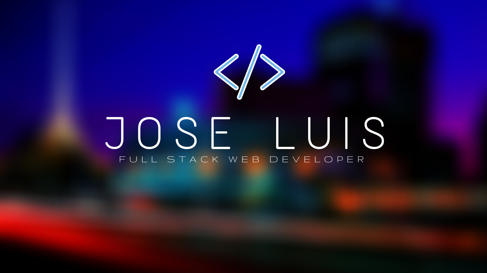

# I'm Jose luis 💻

I'm a **Full Stack Web Developer** with 1+ year intensive training in Fullstack Web Development
(MERN Stack)

## ✨ Current situation
- 🔭 I’m currently seeking for positions to apply

## 👨🏻‍💻 Language & Tools

            </a>     <a href="https://reactjs.org/" target="_blank">       

<!--
**joseluis2289/joseluis2289** is a ✨ _special_ ✨ repository because its `README.md` (this file) appears on your GitHub profile.

Here are some ideas to get you started:

- 🔭 I’m currently working on ...
- 🌱 I’m currently learning ...
- 👯 I’m looking to collaborate on ...
- 🤔 I’m looking for help with ...
- 💬 Ask me about ...
- 📫 How to reach me: ...
- 😄 Pronouns: ...
- ⚡ Fun fact: ...
-->
